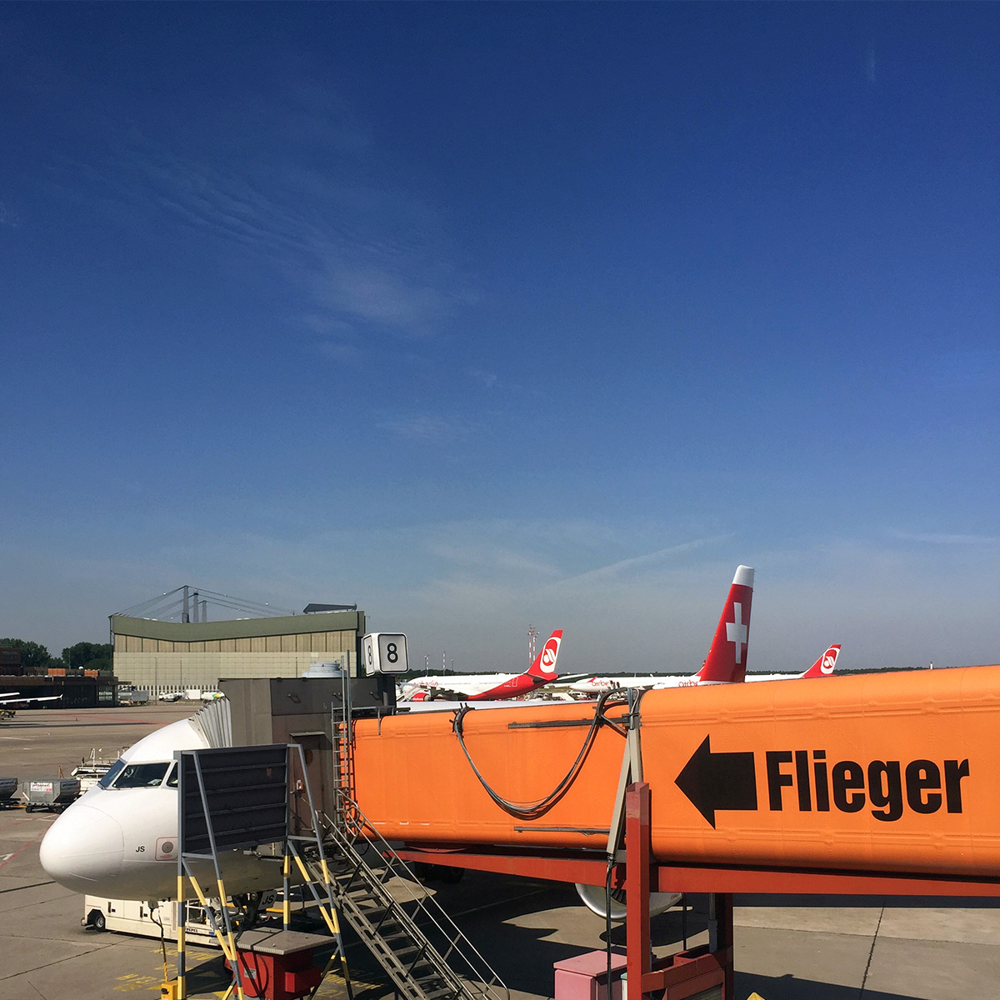
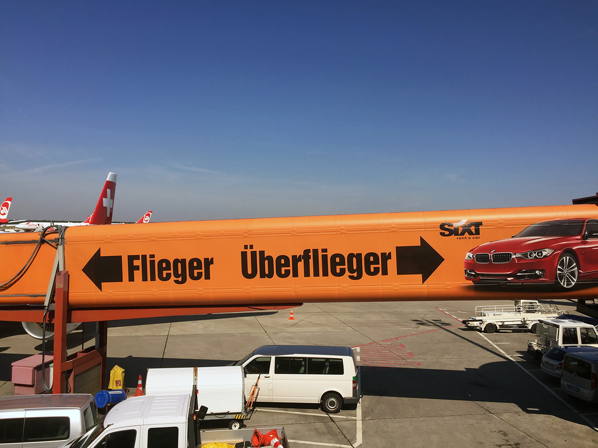

Hier habe ich die Beispiele zur Untersuchung 4 verschiedener Werbungen aufgelistet:

### 1. Sixt «Überflieger»

Flughafen Berlin-Tegel, Fluggastbrücke Gate A8

Fotos: Papa

### 2. Nintendo Switch

<iframe width="560" height="315" src="https://www.youtube.com/embed/jqPuykfbNg8" frameborder="0" allow="accelerometer; autoplay; encrypted-media; gyroscope; picture-in-picture" allowfullscreen></iframe>

### 3. Haribo TV Spots

<iframe width="560" height="315" src="https://www.youtube.com/embed/_AuXHidxbec" frameborder="0" allow="accelerometer; autoplay; encrypted-media; gyroscope; picture-in-picture" allowfullscreen></iframe>

<iframe width="560" height="315" src="https://www.youtube.com/embed/U90HzBnriqE" frameborder="0" allow="accelerometer; autoplay; encrypted-media; gyroscope; picture-in-picture" allowfullscreen></iframe>

### 4. Ritter Sport

Quelle: <a href="https://www.ritter-sport.de/blog/2017/10/04/deutschland-deine-ritter-sport-plakate/" target="_blank">Ritter Sport Blog</a>

